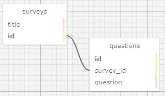

# Survey Designer
#### **Author: Mekinsie Callahan, Andy Lawson**
* * *

## Description

This app lets people design surveys. Survey designers may add, update, and delete survey titles. They may also add any questions that belong within a survey.

## Technologies used

* HTML
* Bootstrap
* git
* Ruby on Rails
* Embedded Ruby (ERB)
* RSpec
* Bundler
* PostgreSQL

* * *
## User Stories

* As a survey designer, I want to create a new survey, so that I can get people's opinion on important matters.
* As a survey designer, I want to add questions to my survey, so that I can find out what people think about various topics.
* As a survey designer, I want to update and delete surveys and questions, in case I change my mind about something.

* * *
## Schema



* * *
## Software Requirements
* **Ruby is required to run this application**
* **PostgreSQL is required to run the database**  

 <a href="https://www.learnhowtoprogram.com/ruby-and-rails/getting-started-with-ruby/installing-ruby">Ruby download instructions</a>  
  <a href="https://www.learnhowtoprogram.com/ruby-and-rails/getting-started-with-ruby/installing-postgres">PosgreSQL download instructions</a>  

## Installation Instructions
1. Navigate to the desired directory where you would like to clone the project to.

2. Once you have chosen your desired directory, clone the github repo using the version control tool `git` (<a href="https://www.learnhowtoprogram.com/introduction-to-programming/getting-started-with-intro-to-programming/git-and-github">download instructions</a>). Typing the following command into your terminal:
```bash
$ git clone https://github.com/mekinsie/gathered_analysis
```
3. Open the project in VSCode by typing the following in your terminal:

``` bash
$ code .
```
* Note: VSCode is a code editing software. If you don't already have it, you can download it <a href="https://code.visualstudio.com/">here</a>

4. While located in the root directory, install gem bundler by typing:

``` bash
$ gem install bundler
```

5. Install gem bundles by typing:

``` bash
$ bundle install
```

6. Create a database for this project by typing the following into your terminal while located in the root directory:
```
$ rake db:create
```

7. Add all tables to the database by typing the following in your terminal:
```
$ rake db:migrate
```

8. Mirror the migration database changes in the test database:
```
$ rake db:test:prepare
```

The database should now be correctly set up. And you may start a local server to interact with the project. 

9. To start a local server, open your default browser and type "localhost:3000" into the search bar and press enter. Here, you will see the live server.

## Running Tests
* This application was created using test-driven development (TDD).
* To run the tests yourself, follow the steps below.

Simply type "rspec" into your terminal while located in the root directory of the project.
``` bash
$ rspec
```
* * *

## License
> [GPLv3](https://choosealicense.com/licenses/gpl-3.0/)\
> Mekinsie Callahan &copy; 2021  
> Andy Lawson &copy; 2021

* * *

## Contact Information

Reach Mekinsie via <a href="https://www.linkedin.com/in/mekinsie/" target="_blank">Linkedin</a> or <a href="mailto:mekinsie.aja@gmail.com" target="_blank">email</a></li>.

Reach Andy via <a href="https://www.linkedin.com/in/andrew-lawson-dev/" target="_blank">Linkedin</a> or <a href="alawson89@gmail.com" target="_blank">email</a></li>.
